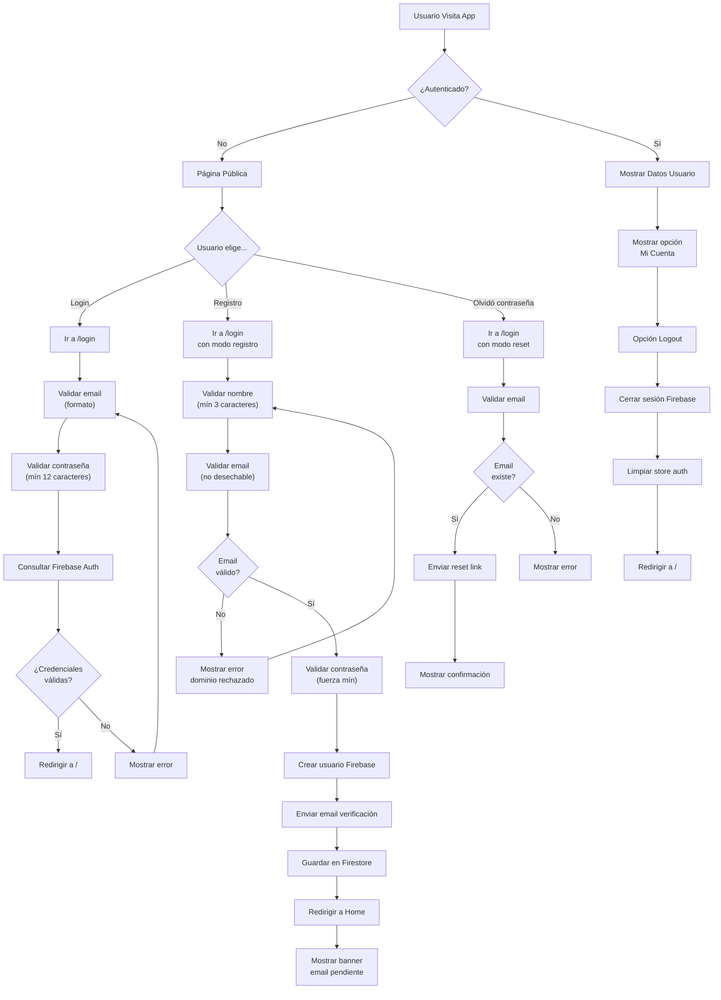
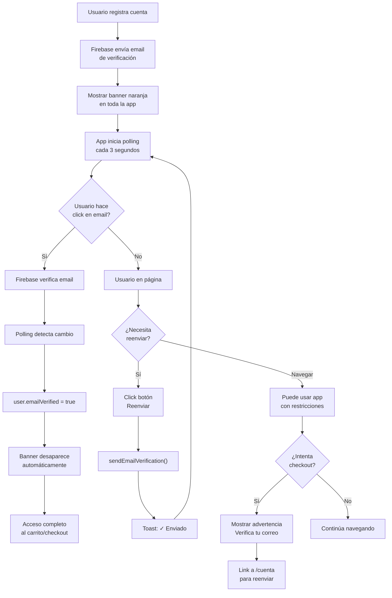
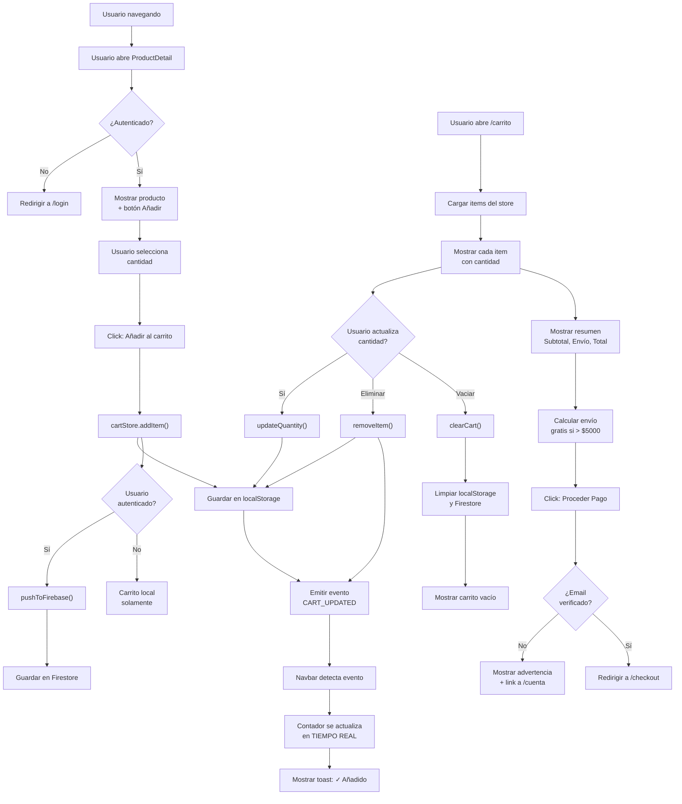
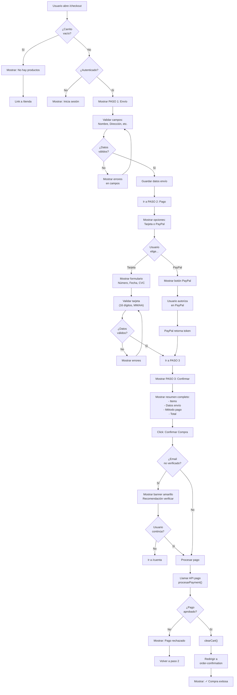
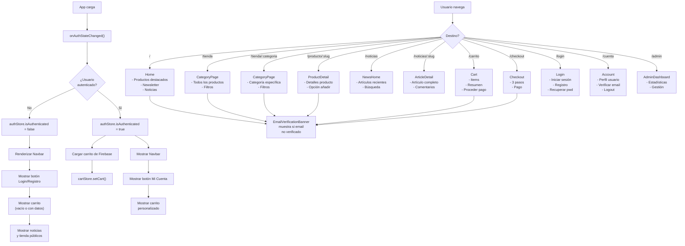
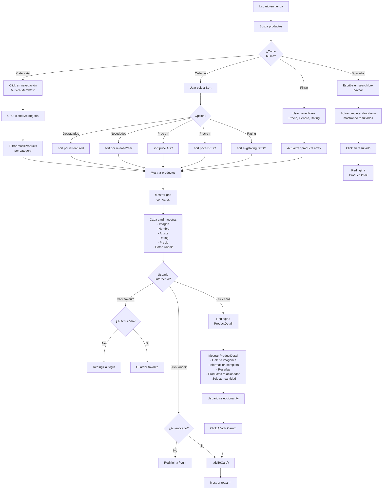
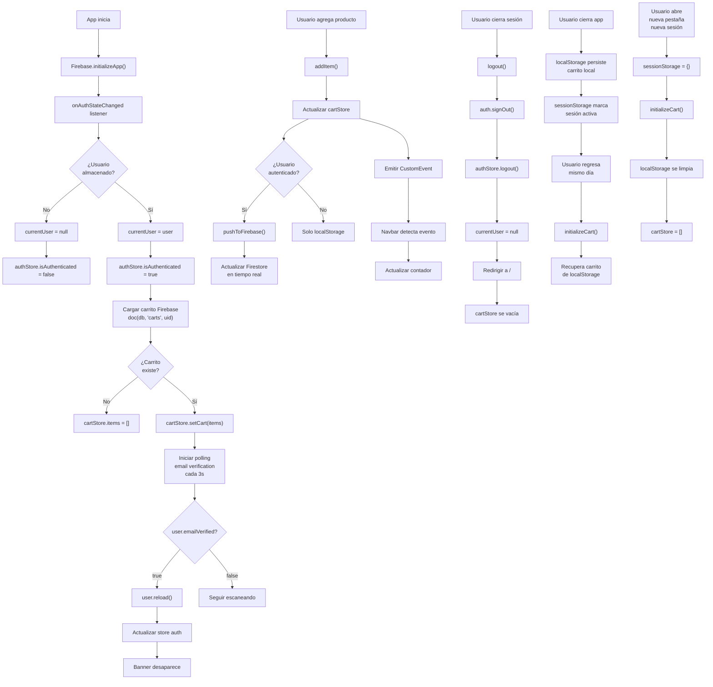

# Groove Music Store - Documentación de Flujos de Aplicación

## 📊 Índice de Flujos

1. **Flujo de Autenticación** - Login, Registro, Recuperación
2. **Flujo de Verificación de Email** - Validación automática
3. **Flujo de Carrito de Compras** - Añadir, actualizar, persistencia
4. **Flujo de Checkout** - Pago y confirmación
5. **Flujo de Navegación General** - Estructura de páginas
6. **Flujo de Productos** - Búsqueda, categorías, detalles
7. **Flujo de Gestión de Sesión** - Autenticación y datos

---

## 1. 🔐 FLUJO DE AUTENTICACIÓN

---

## 2. ✉️ FLUJO DE VERIFICACIÓN DE EMAIL

---

## 3. 🛒 FLUJO DE CARRITO DE COMPRAS

---

## 4. 💳 FLUJO DE CHECKOUT Y PAGO

---

## 5. 🗺️ FLUJO DE NAVEGACIÓN GENERAL

---

## 6. 🔍 FLUJO DE PRODUCTOS Y BÚSQUEDA

---

## 7. 🔗 FLUJO DE GESTIÓN DE SESIÓN Y DATOS

---

## 🎯 RESUMEN DE RUTAS

| Ruta | Componente | Público | Requiere Auth | Descripción |
|------|-----------|---------|---------------|-------------|
| `/` | Home | ✅ | ❌ | Página de inicio |
| `/tienda` | CategoryPage | ✅ | ❌ | Todos los productos |
| `/tienda/:categoria` | CategoryPage | ✅ | ❌ | Productos por categoría |
| `/producto/:slug` | ProductDetail | ✅ | ❌ | Detalles del producto |
| `/carrito` | Cart | ✅ | ❌ | Carrito de compras |
| `/checkout` | Checkout | ❌ | ✅ | Proceso de compra |
| `/noticias` | NewsHome | ✅ | ❌ | Lista de noticias |
| `/noticias/:slug` | ArticleDetail | ✅ | ❌ | Artículo completo |
| `/login` | Login | ✅ | ❌ | Login/Registro/Recovery |
| `/registro` | Login | ✅ | ❌ | Alias para registro |
| `/cuenta` | Account | ❌ | ✅ | Perfil del usuario |
| `/admin` | AdminDashboard | ❌ | ✅ | Panel administrador |

---

## 📱 RESPONSIVIDAD

- **Desktop**: Todos los elementos visibles, menú horizontal
- **Tablet**: Menú parcial, sidebar colapsable
- **Móvil**: Menú hamburguesa, diseño responsive

---

## ⚙️ CONFIGURACIÓN CRÍTICA

### Firebase Auth
- Email/Contraseña habilitado
- Verificación de email requerida (pero no bloquea acceso)
- Reset password implementado

### Firestore
- Colección `users` - Datos de usuario
- Colección `carts` - Carrito persistente por UID
- Colección `products` - Catálogo (mock en client)

### Estado Global (Zustand)
- `authStore` - Usuario actual, autenticación
- `cartStore` - Items, total, operaciones CRUD
- `uiStore` - Estado UI (modal, sidebar, etc.)

### Eventos (CustomEvents)
- `cart:itemAdded` - Producto añadido
- `cart:itemRemoved` - Producto removido
- `cart:updated` - Cualquier cambio carrito

---

Última actualización: **Mayo 23, 2026**
