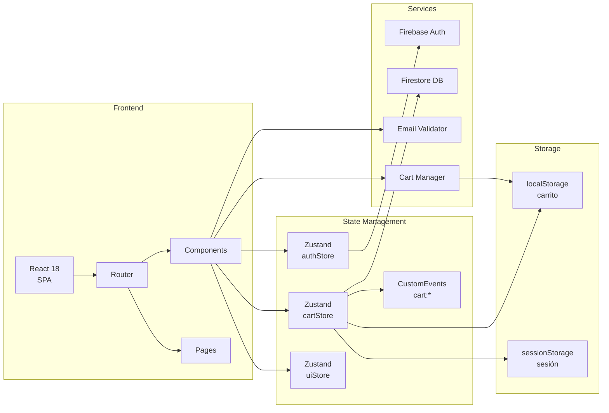
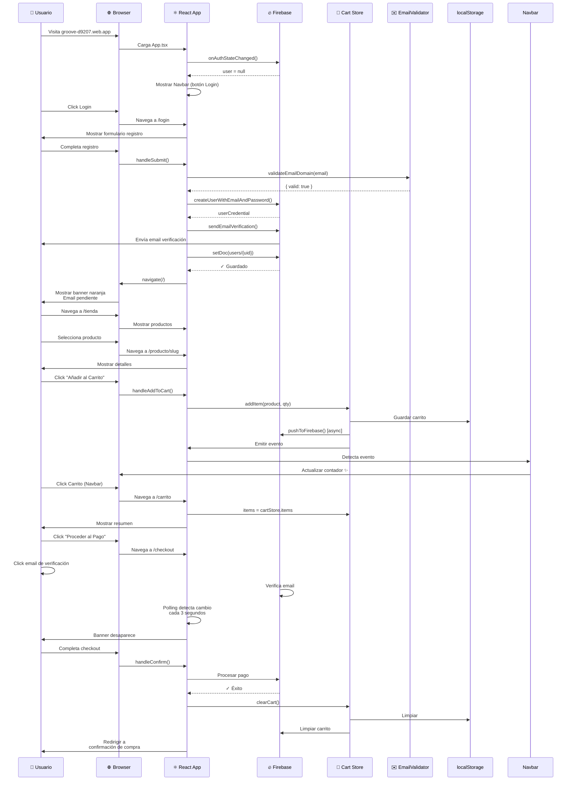
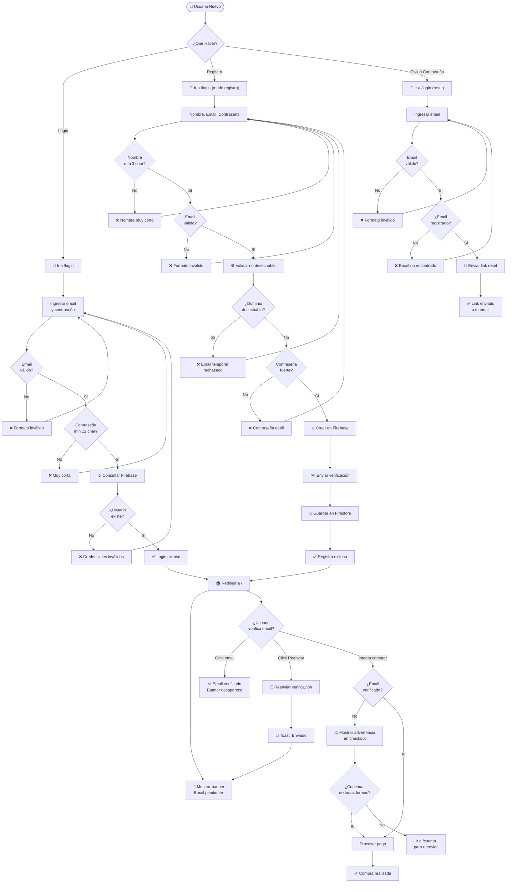
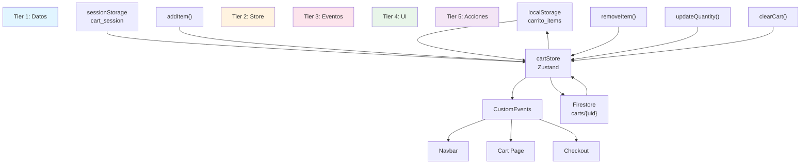
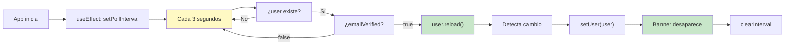
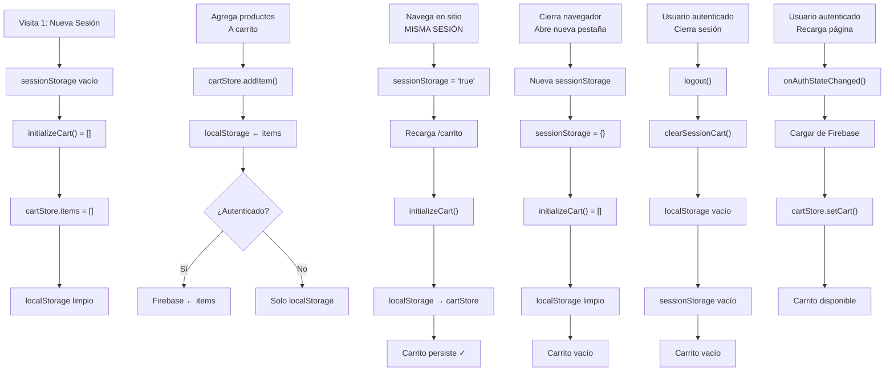
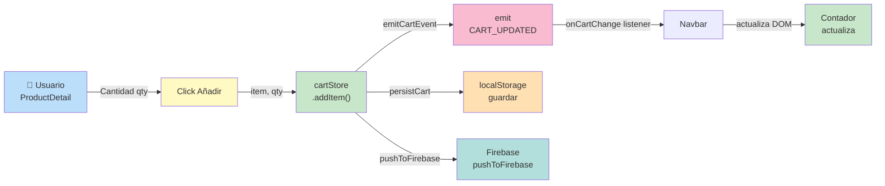
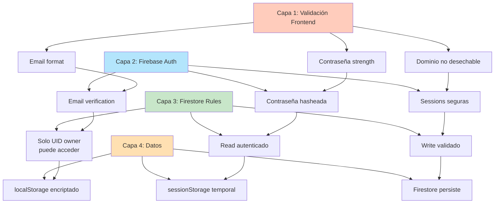

# Groove Music Store - Arquitectura y Flujos Visuales

## 🏗️ ARQUITECTURA GENERAL DEL SISTEMA



---

## 🎯 FLUJO CRÍTICO: USUARIO NUEVO → COMPRA



---

## 📊 DIAGRAMA DE DECISIONES: FLUJO AUTENTICACIÓN



---

## 🛒 DIAGRAMA DE INTERACCIÓN: CARRITO



---

## ✉️ POLLING DE EMAIL VERIFICATION



---

## 🔄 CICLO DE VIDA: SESIÓN DE USUARIO



---

## 🎨 COMPONENTES PRINCIPALES Y RELACIONES

```mermaid
graph TB
    App["App.tsx<br/>Root"]
    
    Navbar["Navbar.tsx<br/>Navigation"]
    EmailBanner["EmailVerificationBanner.tsx<br/>Auth Alert"]
    Footer["Footer.tsx<br/>Footer"]
    
    Home["Home.tsx<br/>Showcase"]
    Category["CategoryPage.tsx<br/>Browse"]
    Product["ProductDetail.tsx<br/>Info"]
    Cart["Cart.tsx<br/>Review"]
    Checkout["Checkout.tsx<br/>Payment"]
    
    News["NewsHome.tsx<br/>Articles"]
    NewsDetail["ArticleDetail.tsx<br/>Full Post"]
    
    Login["Login.tsx<br/>Auth Forms"]
    Account["Account.tsx<br/>Profile"]
    Admin["AdminDashboard.tsx<br/>Management"]
    
    App --> Navbar
    App --> EmailBanner
    App --> Home
    App --> Category
    App --> Product
    App --> Cart
    App --> Checkout
    App --> News
    App --> NewsDetail
    App --> Login
    App --> Account
    App --> Admin
    App --> Footer
    
    Navbar -.->|authStore| Login
    Navbar -.->|authStore| Account
    Navbar -.->|cartStore| Cart
    
    Product -.->|addItem()| Cart
    Cart -.->|Link| Checkout
    Checkout -.->|clearCart()| Cart
    
    Login -.->|setUser()| Account
    Account -.->|logout()| Navbar
    Account -.->|verifyEmail| EmailBanner
    
    style App fill:#ffebee
    style Navbar fill:#e3f2fd
    style EmailBanner fill:#fff3e0
    style Home fill:#f3e5f5
    style Category fill:#e0f2f1
    style Product fill:#e8eaf6
    style Cart fill:#fce4ec
    style Checkout fill:#f1f8e9
    style Login fill:#ede7f6
    style Account fill:#e0f2f1
```

---

## 📈 FLUJO DE DATOS: CARRITO REACTIVO



---

## 🔐 CAPAS DE SEGURIDAD



---

**Documento generado:** Mayo 23, 2026  
**Última actualización:** Deploy en vivo
